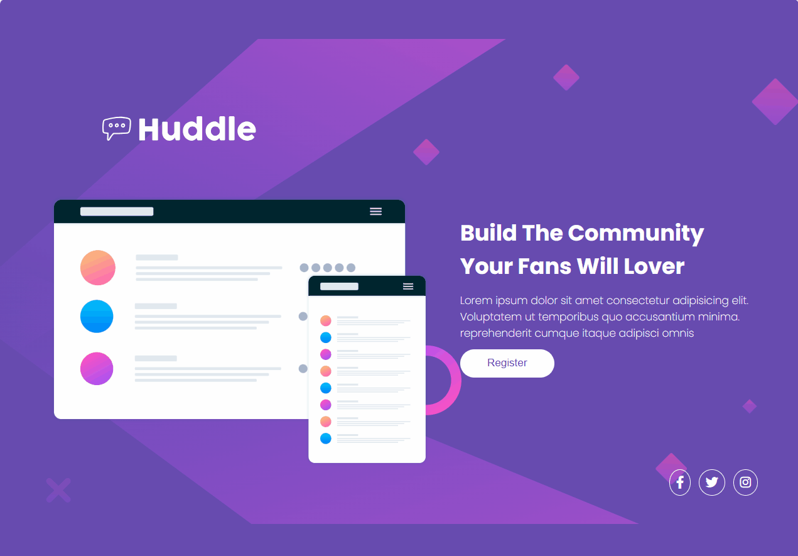
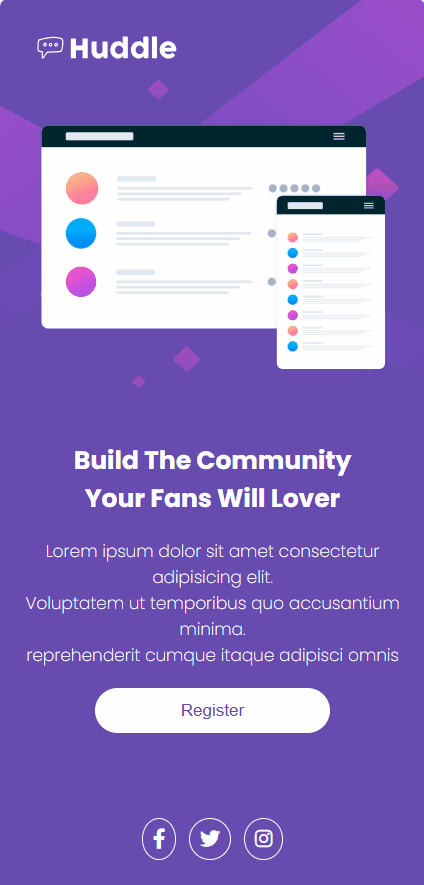

# Huddle Landing Page with Single Introductory Section

## Imagens Gif
[]

[]

## Descrição
Uma landing page simples e responsiva projetada como solução para um desafio do Frontend Mentor. Este projeto apresenta um design limpo, amigável ao usuário, e otimizado para vários dispositivos.

## Funcionalidades
- Exibição de uma ilustração mockup.
- Título e descrição chamativos para engajar visitantes.
- Botão de registro "Register".
- Links para redes sociais com ícones estilizados.
- Responsividade para diferentes tamanhos de tela.

## Tecnologias usadas
- HTML5: Para a estrutura do site.
- CSS3: Para os estilos visuais, incluindo arquivos reset, estilos principais e design responsivo.
- Google Fonts: Para as fontes modernas (Open Sans e Poppins).
- Font Awesome: Para os ícones das redes sociais.

## Contribuições
- Este projeto está aberto para melhorias. Se quiser contribuir, envie um Pull Request ou abra uma issue para discutir novas ideias.